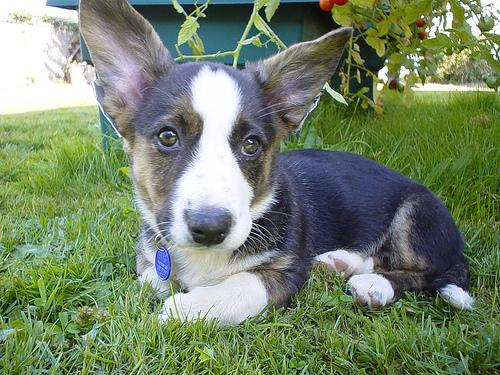

# Описание
Это простая программа, которая работает при помощи API [Яндекс.Диска](https://yandex.ru/dev/disk/poligon/) и [dog.ceo](https://dog.ceo/dog-api/documentation/).
Получает картинки по запросу, создает папку на Диске и загружает их туда

Всё!

# Принцип работы
Здесь будет описан принцип работы пользовательского интерфейса программы,
не погружаясь в технические особенности и методы реализации.
Для этих целей есть [исходный код](https://github.com/hunnidRose/yandex_uploader/blob/main/main.py) с комментариями

## Ввод
1. Пользователь вводит название породы собаки, обязательно на английском языке(регистр не имеет значения). Например: corgi
2. Далее необходимо ввести токен с [Полигона Яндекс.Диска](https://yandex.ru/dev/disk/poligon/)
3. На вашем диске создастся папка с названием породы. Например: Corgi
4. В эту папку загрузится изображение с породой этой собаки
5. Если же у породы есть под-породы, то будет загружено по одному изображению каждой под-породы

Важно: Программа отслеживает наличие повторяющихся изображений в папке, поэтому если такое изображение уже есть, то оно не будет загружено

## Вывод
1. В папке "info" будет создан json-файл с информацией по загруженным изображениям
2. На вашем Яндекс.Диске появится папка с одним или несколькими изображениями

